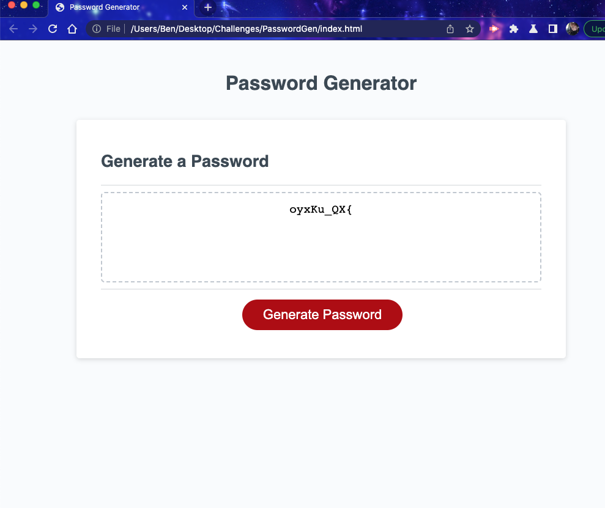

# PasswordGen
This project is used to generate a random password.
This password generator creates a unique password by asking the user specific questions.
The prompt asks you how many characters you want, and letters, and numbers.
It then takes that info and stores it to create a unique pasword that you wanted.
Once all the prompts have ben answered you may then click the generate password button and your password appears.
If you don't want that one, ou may refresh the page and try again until you like one.
This function was created within the java script file and checked using the console within the browser.

readme.md

